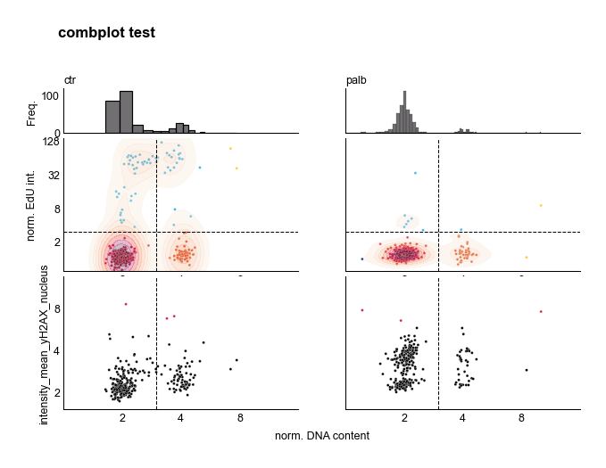
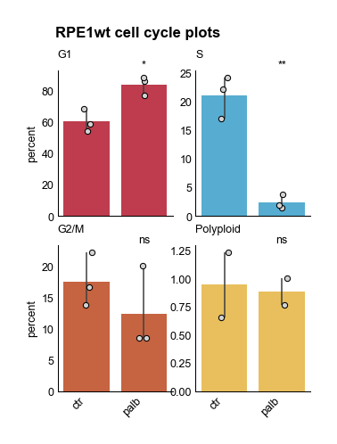
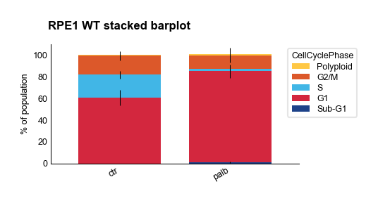
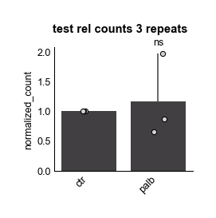
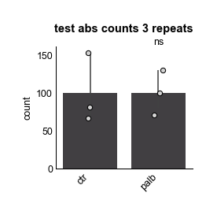
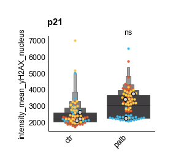

# omero-screen-plots

Plotting Functions for Omero-Screen Immuno-Fluorescence Data.
## Status


Version: 

[](https://www.python.org/downloads/)

[](LICENSE)

## Features
Examples for each plot can be found in jupyter notebooks in tests/examples.
### combplot
Cell Cycle analysis with one selected feature column
platted as a scatterplot along the DAPI axis. (Requires EdU labelling data and cell cycle analysis in the csv file)

```python
from omero_screen_plots.combplot import comb_plot

comb_plot(
    df=df,
    conditions=conditions,
    feature_col="intensity_mean_yH2AX_nucleus",
    feature_y_lim=6000,
    condition_col="condition",  # default
    selector_col="cell_line",  # default
    selector_val="RPE1wt",
    title="combplot test",
    cell_number=1000,
    save=False,
    path=None,
)
```


### cellcycle plot
Quantitative analysis of cell cycle phases for IF data with EdU labeling.
If data from three imaging plates are present statistical analysis is performed
using the scipy stats.ttest_indep function and pvalues are indicated with *, ** and ***
indicating < 0.05, < 0.01, < 0.001

```python
from omero_screen_plots.combplot import cellcycle_plot

for cell_line in df.cell_line.unique():
    cellcycle_plot(
        df=df,
        conditions=conditions,
        condition_col="condition",  # default
        selector_col="cell_line",  # default
        selector_val=cell_line,
        title=f"{cell_line} cell cycle plots",
        save=False,
        path=None,
)
```


### cellcycle stacked barplot
Similar to cellcycle plot but bars are stacked.
Error bars are shown but no stats analysis.

```python
from omero_screen_plots.combplot import stacked_barplot

stacked_barplot(
    df,
    condition_col="condition",
    conditions=conditions,
    selector_col="cell_line",
    selector_val="RPE1wt",
    title="RPE1 WT stacked barplot",
    save=False,
    path=None,
)
```


### count_plot

Provides either relative counts (default) using a given norm_control,
or absolute counts based on an enum PlotType (NORMALISED or ABSOLUTE).
Doesnt require EdU data. Stats are calculated and displayed when three
or more plates are analysed.

```python
from omero_screen_plots.countplot import PlotType, count_plot
count_plot(
    df=df,
    norm_control="ctr",
    conditions=conditions,
    condition_col="condition",
    selector_col="cell_line",
    selector_val="RPE1wt",
    #plot_type = PlotType.NORMALISED, # this is the default!
    title="test rel counts 3 repeats",
    save=False,
)

count_plot(
    df=df,
    norm_control="ctr",
    conditions=conditions,
    condition_col="condition",
    selector_col="cell_line",
    selector_val="RPE1wt",
    plot_type=PlotType.ABSOLUTE,
    title="test abs counts 3 repeats",
    save=False,
)
```



### feature_plot

Shows mixed boxenplot and swarmplot (showing 30 random points per plate, with different colors).
On top medium points for each repeat are shown as larger circles. Stats are analysed and displayed
when three or more plates are in the data set.


```python
from omero_screen_plots.featureplot import feature_plot
feature_plot(
    df=df,
    feature="intensity_mean_yH2AX_nucleus",
    conditions=conditions,
    condition_col="condition",  # default
    selector_col="cell_line",  # default
    selector_val="RPE1wt",
    title="p21",
    save=False,
    path=None,
)
```



## Installation

```bash

# Either clone the repo
git clone https://github.com/Helfrid/omero-screen-plots.git
# and pip install (or uv add)
pip install "path to repo"
# or directly pip install via github link
pip install https://github.com/Helfrid/omero-screen-plots.git
```


## Project Structure
```text
omero-screen-plots/
├── src/
│ └── omero-screen-plots/
├── tests/
├── docs/
└── examples/
```
## Versioning

This project uses [Semantic Versioning](https://semver.org/) and [Conventional Commits](https://www.conventionalcommits.org/).

To bump the version use commitizen:
https://commitizen-tools.github.io/commitizen/

```bash
cz bump
```
## Contributing

1. Fork the repository
2. Create your feature branch (`git checkout -b feature/amazing-feature`)
3. Commit your changes (`cz commit`)
4. Push to the branch (`git push origin feature/amazing-feature`)
5. Open a Pull Request

## Authors


Created by Helfrid Hochegger
Email: hh65@sussex.ac.uk


## Dependencies

Requires Python 3.13 or greater

## License

This project is licensed under the MIT License - see the [LICENSE](LICENSE) file for details

## Acknowledgments

Thanks to the contributors of matplotlib, pandas, seaborn and scipy!

## TODO

Add tests and examples for synergy plots
Add growthcurve plots
